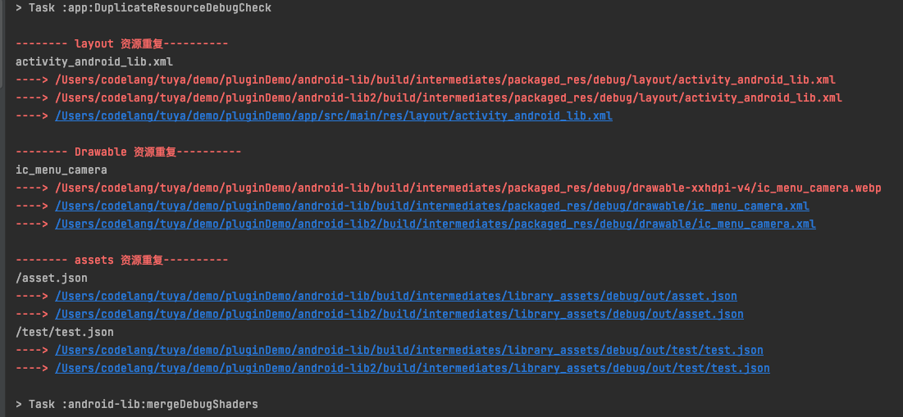

资源重复检查，目前仅支持：
- Drawable 目录重复资源检查
- Assets 目录重复资源检查
- layout 目录重复资源检查

配置 maven 镜像源和依赖
```java
buildscript {
    repositories {
        ...
        // maven 源
        maven{
           url "https://raw.githubusercontent.com/MRwangqi/Maven/main"
        }
    }
    dependencies {
        classpath "com.android.tools.build:gradle:7.0.4"
        // 依赖 resourcePlugin 插件
        classpath "com.github.MRwangqi:resourcePlugin:1.0.0"
    }
}
```

在 app 工程的 build.gradle 中依赖插件(app 为主壳模块)

```java
plugins {
    id 'com.android.application'
    // apply resourcePlugin 插件
    id 'resourcePlugin'
}
```


也有一些小伙伴的项目没有适配 AGP 7.X，所以，这里用 gradle file 写了一遍，但只实现了 layout 的重复检查，其他两个就交由大家自己实现了，照葫芦画瓢，我觉得应该不难。

在 app 工程的 build.gradle 中引入 [resourcePlugin.gradle](../../app/resourcePlugin.gradle) 文件
```aidl
plugins {
    id 'com.android.application'
}
apply from :"resourcePlugin.gradle"
```


示例 demo 运行效果：


